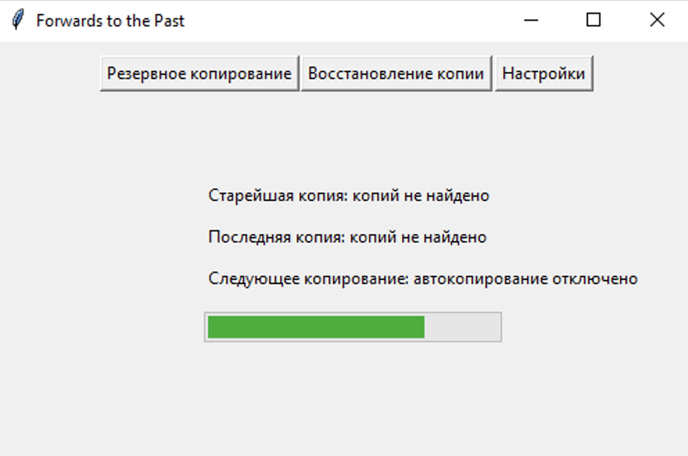

# Forwards to the Past

_Утилита для создания резервных копий файлов._

___

## 1. Выбор папки для хранения резервных копий

При первом запуске программы поверх основного окна будет открыто окно с деревом файлов. В этом окне нужно выбрать папку, в которой будут храниться резервные копии файлов, и нажать `«ОК»`.

___

## 2. Выбор папки с файлами

Далее откроется еще одно окно с деревом файлов. В этом окне нужно выбрать папку, для файлов которой будут создаваться резервные копии. После выбора нажать `«ОК»`.

___

## 3. Создание резервной копии

Сразу после выполнения этих двух действий программа начнет создание первой резервной копии файлов в папке, указанной во втором окне. Дождитесь окончания операции.

Когда резервная копия будет создана, на основном окне программы пропадет полоса прогресса и отобразится кнопка `«Запустить сейчас»`, а также появятся даты резервных копий - самой старой, самой последней и следующей запланированной. Кнопка `«Запустить сейчас»` запускает процесс создания резервной копии и обновляет даты резервных копий на главном окне, в том числе дату следующего запланированного резервного копирования.

_Для дальнейшей корректной работы программы ее необходимо перезапустить._

___

## Восстановление копии

В разделе `«Восстановление копии»` находится список всех резервных копий. 

После выбора нужной даты резервной копии в таблицу будет выведен список файлов, которые содержит выбранная копия. 

Кнопка `«Восстановить»` удалит все имеющиеся файлы в папке, для которой в данный момент настроено резервное копирование, и скопирует в нее резервные копии файлов за указанную дату резервной копии. Получить резервную копию определенного файла можно, выбрав соответствующую ему строку в таблице и кликнув по ней правой кнопкой мыши, а затем нажав на кнопку `«Копировать в...»`. 

Будет открыто окно с деревом файлов, в котором необходимо выбрать папку, в которую будет скопирована указанная резервная копия файла.

___

## Настройки

Раздел `«Настройки»` содержит все параметры программы.
* `«Путь к резервным копиям»` определяет путь к папке, в которой хранятся все резервные копии файлов.
* `«Путь к файлам»` определяет путь к папке, для файлов которой создаются резервные копии.
* `«Интервал резервного копирования»` определяет количество дней, которое должно пройти после последнего запуска резервного копирования, прежде чем программа совершит резервное копирование автоматически.
* `«Часовой пояс»` определяет часовой пояс, в котором будет сохраняться дата создания резервных копий.
* `«Путь к базе данных»` определяет путь к файлу базы данных, в которой хранится информация обо всех резервных копиях.
* `«Срок хранения резервных копий»` определяет, сколько дней будет храниться резервная копия, прежде чем вся информация о ней будет удалена из базы данных. Также будут удалены резервные копии файлов, если информация о них отсутствует в базе данных.
* `«Запускать скрыто»` определяет, будет ли при запуске программы отображаться основное окно.
* Кнопка `«Скрыть графический интерфейс»` скрывает основное окно программы.
* Кнопка `«Сохранить»` записывает настройки (все, кроме `«Запускать скрыто»` - этот пункт применяется сразу) из окна программы в файл `config.ini` в корневой папке программы.

